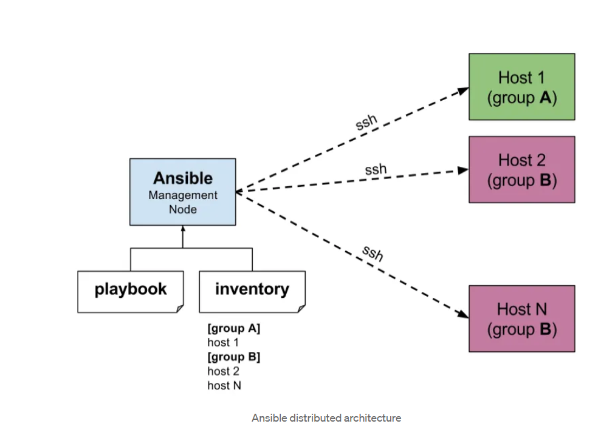

# Ansible Architecture Overview

This repository provides an overview of the architecture of Ansible, a powerful automation tool used for configuration management, application deployment, and task automation.

## Ansible Architecture

In Ansible architecture, we have a **Control Node** and **Managed Nodes**. The Control Node, also known as the Controller Node, serves as the master Ansible server, where Ansible is installed. The Managed Nodes, on the other hand, are the servers or devices that Ansible manages. Communication between the Control Node and Managed Nodes occurs via SSH for Linux clients and WinRM for Windows clients.

### Agentless Nature

Ansible is agentless, meaning it does not require any software or agent to be installed on the Managed Nodes. This sets it apart from other automation tools like Puppet and Chef.

### Push Architecture

Ansible operates on a push architecture, allowing it to push changes simultaneously to multiple Managed Nodes. This push mechanism, combined with parallel execution, significantly reduces the time required for configuration management.

## Basic Terminology

### Inventory File

The Inventory File contains records of Managed Node IP addresses, hostnames, passwords, and groups. There are two types of inventory files: `static and dynamic`. Static inventory files are used when IP addresses are fixed, while dynamic inventory files automatically retrieve IP addresses, typically in cloud environments.

### Modules

Modules in Ansible are scripts written in various languages (e.g., Python, Bash, Ruby) that define tasks to be executed on Managed Nodes. There are two main types of modules: Core modules written in Python and Custom modules written to meet specific requirements.

### Playbooks

Playbooks are written in YAML and serve as a preferred method for performing tasks repeatedly. They define a series of tasks to be executed on Managed Nodes in a structured and reusable format.

## Software and Hardware Requirements

### Software Requirement

The Control Node should run on a Linux operating system with Python version 2.6 or higher. The minimum recommended OS version is RHEL/CentOS 6 or above.

### Hardware Requirement

The hardware requirements for the Control Node depend on the value of the fork parameter, which determines the number of simultaneous connections to Managed Nodes. For production environments, a Control Node with 4 GB RAM is recommended for 100 forks. For learning purposes, 1 GB RAM, 10 GB HDD, and 1 CPU are sufficient.
