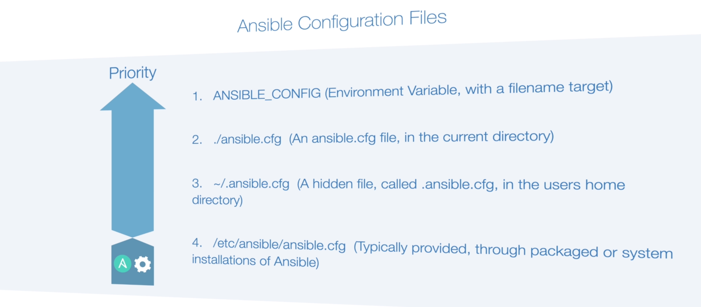

# Ansible Configuration File (ansible.cfg)

## What is ansible.cfg?

`ansible.cfg` is the configuration file for Ansible, a powerful automation tool that simplifies IT orchestration, configuration management, and application deployment. The configuration file allows users to customize various settings to tailor Ansible's behavior according to their needs.

## Usage

1. **Location**: By default, Ansible looks for the `ansible.cfg` file in the following locations, in order:
   - In the current working directory (`./ansible.cfg`)
   - In the user's home directory (`~/.ansible.cfg`)
   - In `/etc/ansible/ansible.cfg`

   You can specify a different location using the `-c` or `--config-file` option when running Ansible commands.

2. **Contents**: The `ansible.cfg` file is in INI format, consisting of sections and key-value pairs. You can configure various options such as default inventory file, remote user, connection type, module location, etc.

## Ansible Configuration Priority

## Configuration Precedence

Configuration settings include both values from the `ansible.cfg` file and environment variables. Environment variables have higher precedence than entries in the `ansible.cfg` file. Ansible uses the first `ansible.cfg` file it finds, ignoring all others.

### Precedence Order

1. **Environment Variables**: Environment variables, if set, take precedence over settings in the `ansible.cfg` file. Specifically, Ansible checks for the presence of an environment variable named `ANSIBLE_CONFIG`.

2. **ansible.cfg**: In the absence of an `ANSIBLE_CONFIG` environment variable, Ansible reads configuration settings from the `ansible.cfg` file located in the current directory.

3. **~/.ansible.cfg**: If neither an environment variable nor a local `ansible.cfg` file exists, Ansible looks for the configuration file in the user's home directory (`~/.ansible.cfg`).

4. **/etc/ansible/ansible.cfg**: If no other configuration file is found, Ansible resorts to using the system-wide configuration file located at `/etc/ansible/ansible.cfg`.
